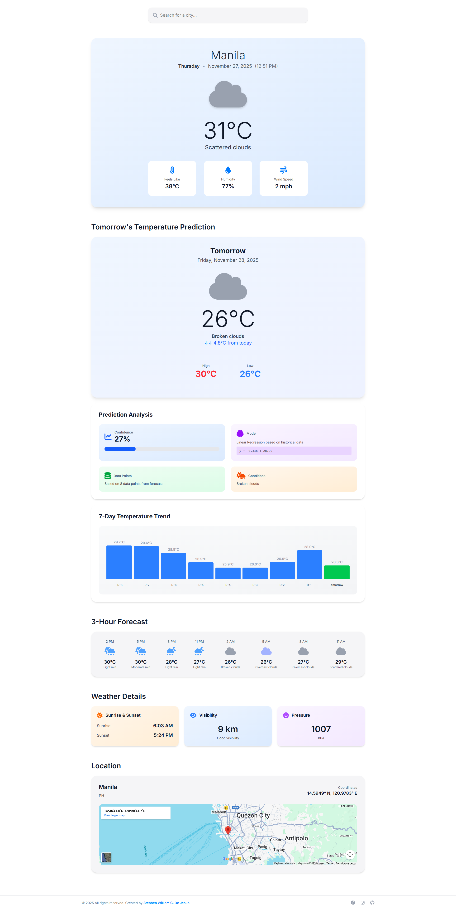

# 🌤️ ML Weather Predictor — Real-Time Weather & AI-Powered Tomorrow's Forecast

A modern, intelligent weather application built with **HTML5**, **Tailwind CSS**, **JavaScript**, and **Machine Learning**.  
Get real-time weather information, 3-hour forecasts, and AI-powered temperature predictions for tomorrow using linear regression on historical data.

Crafted by **[Stephen William G. De Jesus](https://www.facebook.com/stephenwilliam.dejesus.5/)**, this project demonstrates advanced API integration, machine learning algorithms, dynamic data visualization, and responsive design.

🌐 Live Demo: [View Live Demo](https://bogiiiie.github.io/21-javascript-ml-weather-app/)

---

## 📸 Preview  

### 🖼️ Application Screenshot  


### 🎞️ Live Interaction (GIF)  


---

## ✨ Features

### 🌡️ Current Weather
- **Real-Time Data** – Live temperature, humidity, wind speed, and atmospheric conditions
- **Weather Icons** – Dynamic visual indicators that change based on conditions
- **Detailed Metrics** – Feels like temperature, visibility, pressure, sunrise/sunset times
- **Interactive Map** – Embedded Google Maps showing the searched location

### 🤖 AI-Powered Predictions
- **Machine Learning** – Linear regression model predicts tomorrow's temperature
- **Confidence Score** – Shows prediction accuracy with visual progress bar
- **Temperature Trends** – Interactive 7-day chart with historical and predicted data
- **Regression Formula** – Displays the mathematical model used for predictions
- **Data Analysis** – Shows number of data points and weather conditions

### ⏰ 3-Hour Forecast
- **8 Time Slots** – Weather predictions for the next 24 hours in 3-hour intervals
- **Visual Timeline** – Easy-to-read horizontal forecast cards
- **Detailed Info** – Temperature and conditions for each time period

### 🎨 User Experience
- **City Search** – Search weather for any city worldwide with real-time validation
- **Smart Notifications** – Loading states and error handling
- **Responsive Design** – Seamless experience on desktop, tablet, and mobile
- **Modern UI** – Clean, Apple-inspired design with smooth animations
- **Accessibility Ready** – ARIA labels, semantic HTML, keyboard navigation

---

## 🧠 Machine Learning Features

### Linear Regression Model
The app uses **linear regression** to predict tomorrow's temperature based on forecast data:

1. **Data Collection** – Fetches 8 data points from OpenWeather forecast API
2. **Regression Analysis** – Calculates slope and intercept using least squares method
3. **Prediction** – Applies the formula `y = mx + b` to predict next day's temperature
4. **Confidence Calculation** – Uses R-squared to measure prediction accuracy
5. **Visualization** – Displays historical data and prediction in an interactive chart

### Prediction Accuracy
- **R-squared Score** – Measures how well the model fits the data (0-100%)
- **Temperature Change** – Shows expected increase or decrease from today
- **Data Points** – More data points generally lead to better predictions
- **Visual Feedback** – Color-coded indicators (green for prediction, blue for historical)

---

## 🖥️ How to Use

1. **Default Location** – App loads with Manila, Philippines weather data
2. **Search City** – Type any city name in the search box
3. **Press Enter** – Get instant weather data and AI predictions
4. **View Current Weather** – See temperature, humidity, wind, and more
5. **Check Tomorrow** – View ML-predicted temperature with confidence score
6. **Explore Forecast** – Browse 3-hour intervals for the next 24 hours
7. **Analyze Trends** – Study the 7-day temperature chart

---

## 🛠️ Built With

- [HTML5](https://developer.mozilla.org/en-US/docs/Web/Guide/HTML/HTML5) – Semantic structure with SEO optimization
- [Tailwind CSS](https://tailwindcss.com/) – Utility-first styling framework
- [JavaScript ES6+](https://developer.mozilla.org/en-US/docs/Web/JavaScript) – Modern async/await and ML algorithms
- [OpenWeatherMap API](https://openweathermap.org/api) – Weather and forecast data provider
- [Font Awesome](https://fontawesome.com/) – Icons for weather conditions and UI
- [Google Fonts (Inter)](https://fonts.google.com/specimen/Inter) – Clean, modern typography
- [Google Maps Embed API](https://developers.google.com/maps/documentation/embed) – Location visualization

---

## 📁 Project Structure

```
21-javascript-ml-weather-app/
├── index.html              # Main HTML with structured data and SEO
├── script.js               # Core JavaScript with ML algorithms and API integration
├── src/
│   ├── input.css          # Tailwind CSS source file
│   └── output.css         # Compiled Tailwind CSS styles
└── images/
    ├── demo.png           # Application screenshot
    └── demo.gif           # Demo animation
```

---

## 🚀 Getting Started

To run this project locally:

```bash
git clone https://github.com/bogiiiie/21-javascript-ml-weather-app.git
cd 21-javascript-ml-weather-app
```

### API Key Setup
1. Sign up at [OpenWeatherMap](https://openweathermap.org/api)
2. Get your free API key (1,000 calls/day)
3. Replace the API key in `script.js`:
```javascript
const API_KEY = "your_api_key_here";
```

### Launch Application
```bash
open index.html
```

**No build process required** – Just open `index.html` in your browser!

---

## 🎯 Core Functions

### API Integration
- `getGeo(city)` – Converts city name to coordinates using Geocoding API
- `getCurrentWeather(city)` – Fetches current weather conditions
- `get3HourForecast(city)` – Retrieves 3-hour interval forecast data
- `getCompleteWeatherData(city)` – Orchestrates all API calls and data processing

### Machine Learning
- `calculateLinearRegression(data)` – Implements least squares linear regression
- `predictTemperature(historicalData)` – Predicts next day temperature
- `predictWeatherData(currentWeather, historicalData)` – Generates complete ML analysis

### UI Updates
- `updateCurrentWeather(data)` – Renders current weather section
- `updateTomorrowPrediction(data)` – Displays ML predictions and analysis
- `updateTemperatureChart(historicalData, prediction)` – Creates interactive data visualization
- `update3HourForecast(data)` – Renders hourly forecast timeline

---

## 🧮 Machine Learning Algorithm

### Linear Regression Implementation

```javascript
// Calculate slope (m) and intercept (b) for y = mx + b
function calculateLinearRegression(data) {
    const n = data.length;
    const xMean = mean(data.map(d => d.day));
    const yMean = mean(data.map(d => d.temp));
    
    const slope = Σ[(xi - x̄)(yi - ȳ)] / Σ[(xi - x̄)²]
    const intercept = ȳ - slope * x̄
    
    return { slope, intercept };
}
```

### Confidence Calculation (R-squared)

```javascript
// R² = 1 - (SS_residual / SS_total)
// Measures prediction accuracy from 0% to 100%
const rSquared = 1 - (ssResidual / ssTotal);
const confidence = Math.max(0, Math.min(100, rSquared * 100));
```

---

## ♿ Accessibility Features

- **ARIA Labels** – Dynamic labels for weather data and predictions
- **Semantic HTML** – Proper structure with sections and headings
- **Screen Reader Support** – Descriptive text for all interactive elements
- **Keyboard Navigation** – Full keyboard support for search and navigation
- **Focus Management** – Clear focus indicators throughout the app
- **Time Elements** – Proper datetime attributes for temporal data
- **Alt Text** – Descriptive labels for icons and visual elements

---

## 📱 Responsive Design

- **Mobile-First** – Optimized for smartphones (320px+)
- **Tablet Support** – Perfect layout for medium screens
- **Desktop Experience** – Full-featured layout for large displays
- **Touch-Friendly** – Large tap targets for mobile users
- **Flexible Grid** – Adapts to any screen size seamlessly
- **Readable Typography** – Scalable fonts with proper contrast

---

## 🌐 API Integration

### OpenWeatherMap APIs Used
1. **Geocoding API** – Converts city names to latitude/longitude
2. **Current Weather API** – Real-time weather conditions
3. **5 Day / 3 Hour Forecast API** – Extended forecast data for predictions

### API Features
- **Error Handling** – Graceful handling of network issues and invalid cities
- **Rate Limiting** – Efficient usage to stay within free tier limits
- **Data Processing** – Transforms raw API data into usable format
- **Async/Await** – Modern JavaScript for clean, readable code

---

## 🔧 Technical Features

- **Async/Await** – Modern JavaScript for API calls
- **Promise.all()** – Parallel API requests for faster loading
- **Error Boundaries** – Comprehensive error handling with user feedback
- **Dynamic DOM Manipulation** – Real-time UI updates
- **Data Visualization** – Custom chart rendering with vanilla JavaScript
- **SEO Optimized** – Meta tags, Open Graph, and structured data
- **Performance** – Efficient rendering and minimal API calls

---

## 📊 Data Visualization

### Temperature Trend Chart
- **Historical Bars** – Blue bars showing past temperature data
- **Prediction Bar** – Green bar highlighting tomorrow's predicted temperature
- **Tooltips** – Hover to see exact temperature values
- **Responsive** – Adapts to screen size with proper scaling
- **Dynamic Range** – Automatically adjusts min/max for better visualization

---

## 🔔 Features Breakdown

### Current Weather Section
- City name with state/country
- Current date, day, and time
- Large weather icon
- Temperature in Celsius
- Weather description
- Feels like temperature
- Humidity percentage
- Wind speed in mph

### Tomorrow's Prediction Section
- Predicted temperature
- Temperature change from today
- High/low temperatures
- Weather icon for tomorrow
- ML confidence score with progress bar
- Regression formula display
- Number of data points used
- Expected weather conditions
- Interactive 7-day temperature chart

### 3-Hour Forecast Section
- 8 time slots (24 hours)
- Time display (12-hour format)
- Weather icons
- Temperature for each interval

### Weather Details Section
- Sunrise and sunset times
- Visibility distance
- Atmospheric pressure
- Location coordinates
- Interactive Google Maps embed

---

## 🔧 Troubleshooting

### Common Issues

**API Key Error:**
- Ensure your OpenWeatherMap API key is valid and activated
- Keys may take a few hours to activate after signup
- Check your API usage limits in the OpenWeather dashboard

**City Not Found:**
- Check spelling and try alternative city names
- Try adding country code (e.g., "London, UK")
- Use major cities for better results

**Prediction Accuracy:**
- Confidence scores below 50% indicate uncertain predictions
- Weather is inherently difficult to predict with limited data
- Model works best in stable weather conditions

**Chart Not Displaying:**
- Ensure JavaScript is enabled in your browser
- Check browser console for errors
- Refresh the page to reload data

### Browser Support

- **Modern Browsers:** Chrome 90+, Firefox 88+, Safari 14+, Edge 90+
- **Mobile Browsers:** iOS Safari 14+, Chrome Mobile 90+
- **Requirements:** ES6+ support, Fetch API, CSS Grid

---

## 📈 API Usage & Limits

### OpenWeather Free Tier
- **Daily Limit:** 1,000 calls per day
- **Per Minute:** 60 calls per minute
- **API Calls Per Search:** 3 calls (geocoding + current + forecast)
- **Estimated Usage:** ~333 city searches per day

### Monitoring Your Usage
1. Visit [OpenWeather Dashboard](https://home.openweathermap.org/)
2. Check "Statistics" section
3. Monitor daily call count
4. Set up alerts if available

---

## 👨‍💻 Author

**Stephen William G. De Jesus**

- 🌐 **Facebook:** [Stephen William De Jesus](https://www.facebook.com/stephenwilliam.dejesus.5/)
- 💻 **GitHub:** [@bogiiiie](https://github.com/bogiiiie)
- 📸 **Instagram:** [@stephenwilliamdejesus](https://www.instagram.com/stephenwilliamdejesus/)

---

## 📄 License

© 2025 All rights reserved. Created by Stephen William G. De Jesus.

---

## 🚀 Future Enhancements

- 🎯 **Advanced ML Models** – Neural networks for more accurate predictions
- 📅 **7-Day Forecast** – Extended predictions with daily breakdown
- 📍 **Geolocation** – Automatic weather for user's current location
- 🌍 **Weather Maps** – Interactive radar and satellite imagery
- 🌙 **Dark Mode** – Toggle between light and dark themes
- ⭐ **Favorite Cities** – Save and manage multiple locations
- 🚨 **Weather Alerts** – Severe weather notifications
- 🌡️ **Unit Conversion** – Toggle Celsius/Fahrenheit
- 📊 **Historical Data** – Compare past weather trends
- 📱 **PWA Support** – Install as a native mobile app
- 🔄 **Auto Refresh** – Periodic background updates
- 🎨 **Weather Animations** – Animated weather conditions
- 📈 **Data Export** – Download weather data as CSV
- 🗺️ **Multiple Locations** – Compare weather across cities

---

## 🙏 Acknowledgments

- [OpenWeatherMap](https://openweathermap.org/) for providing weather data API
- [Tailwind CSS](https://tailwindcss.com/) for the utility-first CSS framework
- [Font Awesome](https://fontawesome.com/) for beautiful icons
- [Google Fonts](https://fonts.google.com/) for the Inter typeface

---

## 📝 Notes

- This is a learning project demonstrating ML integration with weather APIs
- The linear regression model uses forecast data as a proxy for historical data
- API key is visible in the source code (acceptable for portfolio projects)
- For production apps, implement proper backend authentication
- Monitor your API usage to stay within free tier limits

---

**Made with ❤️ by Stephen William G. De Jesus**
